# Tollgate architecture

## Simplified

Agent calls go through the Edge (content checks) and the Hub (per-role gate) to the source MCPs. LLM calls go through the model door (prompt scanned before any upstream call) to Ollama or the offline scripted model. `policy.yaml` hot-reloads into both; the signed feed updates Edge signatures; every decision lands in the audit JSONL. Two UIs read it: the local edge `/edge` (developer laptop, full text stays local) and the server console `/console` (security lead, fingerprints only). The simplified picture predates the UIs: its "Dashboard" box is now the console and edge UI, and "human approval" is API-only (`/admin/approvals`).

## Detailed

```mermaid
flowchart LR
    agent["Agent / MCP client<br/>(Claude, Cursor, script)<br/>key minted per launch"]
    llm["Agent's LLM calls"]

    subgraph gw["tollgate serve (one process)"]
        direction LR
        key["Key check<br/>Bearer key bound to role → 401<br/>peer revoked / role removed → 401"]
        subgraph hub["Hub: RoleGate middleware, /mcp/&lt;role&gt;/"]
            direction TB
            role["Role MCP<br/>tools/list filtered, call denied again<br/>role.denied"]
            limits["Argument limits<br/>path glob, select_only<br/>role.constraint"]
            loops["Loop cut-off<br/>same key+tool+args &gt; N<br/>loop.cutoff"]
            taint["Session taint<br/>untrusted + private → public_sink<br/>taint.flow"]
            role --> limits --> loops --> taint
        end
        subgraph edge["Edge: content pipeline scan()"]
            direction TB
            norm["Normalise<br/>NFKC, invisibles, base64"]
            t1["Tier 1<br/>PII + checksum, secrets,<br/>injection phrases, signatures"]
            t2["Tier 2 (gated)<br/>DeBERTa ONNX on CPU"]
            norm --> t1 --> t2
        end
        door["Model door /v1/chat/completions<br/>allow-list → budget 429 → prompt scan<br/>→ upstream → response scan"]
        audit[("audit/events.jsonl<br/>one AuditEvent per decision")]
        puller["Feed puller (lifespan task)<br/>every interval_s: GET bundle,<br/>verify HMAC, newer version only"]
        admin["/healthz (pin_alerts, feed) /admin/taint /admin/budget<br/>/admin/approvals (POST needs admin token)"]
        edgeui["Local edge UI /edge<br/>sessions trace, checks in ms,<br/>setup, Acme scenario"]
        console["Server console /console<br/>overview, peers & roles, sessions (fingerprints),<br/>policy view/switch/edit, threat feed, self-test"]
    end

    subgraph src["Source MCPs (mocks, in-process)"]
        github["github"]
        tickets["tickets (SQLite)"]
        files["files"]
    end

    policy[["policy.yaml<br/>(policies/strict|balanced|lenient)"]]
    ollama["Ollama<br/>qwen3:1.7b / qwen3:4b"]
    peersreg[("audit/peers.json<br/>peers, roles, one-time enroll tokens")]
    laptop["Laptop: tollgate enroll TOKEN<br/>tollgate connect CLIENT --role R --peer P"]
    evaljson[("audit/eval.json, tests.json, perf.json<br/>from tollgate test / perf")]
    feedsrv["Signature feed server<br/>tollgate feed serve :8090<br/>GET /bundle.json (HMAC-signed)"]
    sigs[["signatures.yaml"]]

    agent -->|"MCP over HTTP"| key --> role
    taint -->|"tool args"| edge
    edge -->|"allowed / redacted call"| src
    src -->|"tool result"| edge
    edge -->|"result, redacted"| agent
    llm --> door
    door -.->|"prompt + response"| edge
    door -->|"Ollama, or scripted model<br/>(--scripted-model)"| ollama
    policy -.->|"hot reload: stat() per request,<br/>invalid file rejected"| hub
    policy -.-> door
    policy -.->|"content: section"| edge
    hub --> audit
    door --> audit
    audit --> edgeui
    audit -->|"sha256 only, no text"| console
    laptop -->|"enroll once; mint a key per launch"| peersreg
    peersreg -.->|"verify(): revoked peer / removed role"| key
    console -->|"set roles, revoke, enroll token"| peersreg
    console -->|"profile switch / access edit<br/>(backup + atomic write)"| policy
    console -->|"publish a signature"| feedsrv
    evaljson --> console
    feedsrv -->|"pull"| puller
    puller -->|"atomic write<br/>(tmp + os.replace)"| sigs
    sigs -.->|"mtime reload"| t1
    admin --> console
```

How a tool call flows, as built in `tollgate/gateway/__init__.py`:

1. The agent connects to `/mcp/<role>/` with a role key; `require_key` returns 401 unless the key is valid and bound to that role.
2. Tool pinning: at startup every source tool's name + description + input schema is hashed. A tool whose hash later changes (rug pull) is hidden from `tools/list`, its calls are denied (`pin.changed`), and the alert is audited and listed in `/healthz` `pin_alerts`. Re-pinning is a restart.
3. `RoleGate` (fastmcp middleware) re-reads `policy.yaml` on every request; `tools/list` is filtered, and `tools/call` is denied again for a tool outside the role (`access: read|rw` or an exact `tools:` list).
4. Argument limits (`constrain:`) check path globs and `select_only` SQL before anything is forwarded.
5. The loop cut-off blocks the same key + tool + arguments more than `loops.max_identical_calls` times in a row.
6. Session taint (keyed by role key, not MCP session id) blocks a `public_sink` call once the session has both read an `untrusted_source` and a `private_data` tool; the message names both causes. With `taint.block_flow.action: approve`, or a tool in `roles.<role>.approval`, the call is parked instead: it appears in `GET /admin/approvals` and waits up to `approval.timeout_s` for `POST /admin/approvals/{id}` (`TOLLGATE_ADMIN_TOKEN`, never a role key) or `tollgate approve|deny <id>`. Deny or timeout fails closed (`approval.denied` / `approval.timeout`).
7. The content pipeline scans the tool arguments (block or redact in place), the call goes to the source MCP, and the result is scanned again (redacted before the agent sees it). Tier 2 runs synchronously only on short text, at `sync_points`, or on a tier 1 escalation.
8. The model door applies the same idea to LLM traffic: per-role model allow-list, daily token budget (429), prompt and response scans, then Ollama.
9. Every decision writes one `AuditEvent` (verdict, reasons, per-stage `latency_ms`, taint flags, sha256 of the content, never the raw text) to `audit/events.jsonl`. The local edge keeps the full text in a local store (`keep_text`, retention) for `/edge`; the console only ever shows the fingerprint.
10. Measured: hub checks p95 under 1 ms, tier 1 p95 2.5 ms, tier 2 on short text ~65–90 ms p95 against an 80 ms target (borderline; gated so long tool results skip it in balanced). Sources: `audit/perf.json` (`tollgate perf`) and `audit/eval.json`.
11. A policy edit takes effect on the next call; an invalid file is rejected and the previous policy keeps running (`/healthz` shows the error).
12. `tollgate up` runs the gateway in-process, serving `/console` and `/edge`; `--scripted-model` points the model door at an in-process scripted hijacked model, so no Ollama is needed. The superseded Streamlit dashboard starts only with `--streamlit` (or `tollgate dashboard`).
13. P6 signature feed (`tollgate/feed/`): `tollgate feed serve` is the externally managed system; it serves `feed/bundle_src.yaml` as `{version, issued_at, signatures, sig}`, `sig` = HMAC-SHA256 (`TOLLGATE_FEED_SECRET`) over the canonical JSON of the rest. `tollgate feed publish --add 'id=..,pattern=..,action=block,tags=A;B'` appends a rule and bumps the version. With `feed: {url, interval_s}` in the policy, a lifespan task pulls the bundle, rejects a bad signature (`/healthz` `feed.last_error`, file untouched), and writes a newer version to `content.signatures` atomically, stamped `# feed-version: N` so a restart does not rewrite it. Tier 1 picks the file up by mtime on the next scan. Without `feed:` the local file is authoritative. `tollgate up` also starts the feed server when `feed:` is set. The seed bundle adds model supply-chain rules: pickle `GLOBAL` opcodes, `torch.load` without `weights_only=True`, `trust_remote_code=True`, `yaml.load` without `SafeLoader`, and langchain PALChain / PythonREPLTool (CVE-2023-36258 / GHSA-2qmj-7962-cjq8, CVE-2023-36188, CVE-2023-36095).
14. Identity (`tollgate/gateway/peers.py`): a laptop enrolls once with a one-time token (`tollgate enroll-token` or the console's Enroll a laptop; 24 h expiry); the admin sets which roles it may run (Peers & roles). `tollgate connect claude-code|cursor|print --role R --peer P` mints a key per agent launch (`tg_<role>_<peer>-<n>_<mac>`), so each run starts with clean taint. Minting is refused for a revoked peer or a role it may not run; revoking a peer, or removing a role from it, invalidates its keys on the next request. `tollgate seed-fleet` enrolls 6 demo laptops and drives real traffic through the gateway with minted keys.
15. Console (`tollgate/console.py`, `tollgate/console3.py`, `tollgate/ui/console/`): `/console/api/*` (loopback or the admin token). Policy writes (profile switch, role × server × tool access edits) back up the file, write atomically and reload; a conflicting concurrent edit gets 409; an invalid file shows "Edit rejected … Still enforcing <version>". Threat feed lists signatures in force and publishes a signed one; Self-test shows the eval headline against targets and the misses, and can rerun the eval.
