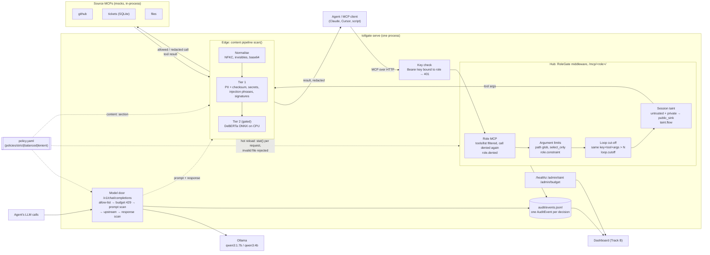

# Tollgate architecture

How a tool call flows, as built in `tollgate/gateway/__init__.py`:

1. The agent connects to `/mcp/<role>/` with a role key; `require_key` returns 401 unless the key is valid and bound to that role.
2. `RoleGate` (fastmcp middleware) re-reads `policy.yaml` on every request; `tools/list` is filtered, and `tools/call` is denied again for a tool outside the role (`access: read|rw` or an exact `tools:` list).
3. Argument limits (`constrain:`) check path globs and `select_only` SQL before anything is forwarded.
4. The loop cut-off blocks the same key + tool + arguments more than `loops.max_identical_calls` times in a row.
5. Session taint (keyed by role key, not MCP session id) blocks a `public_sink` call once the session has both read an `untrusted_source` and a `private_data` tool; the message names both causes.
6. The content pipeline scans the tool arguments (block or redact in place), the call goes to the source MCP, and the result is scanned again (redacted before the agent sees it). Tier 2 runs synchronously only on short text, at `sync_points`, or on a tier 1 escalation.
7. The model door applies the same idea to LLM traffic: per-role model allow-list, daily token budget (429), prompt and response scans, then Ollama.
8. Every decision writes one `AuditEvent` (verdict, reasons, per-stage `latency_ms`, taint flags, sha256 of the content, never the raw text) to `audit/events.jsonl`, which the dashboard reads.
9. Measured (`tollgate perf`, `audit/perf.json`): Hub checks p95 about 0.5 ms, tier 1 p95 about 0.4 ms; tier 2 comes from `audit/eval.json`.
10. A policy edit takes effect on the next call; an invalid file is rejected and the previous policy keeps running (`/healthz` shows the error).
