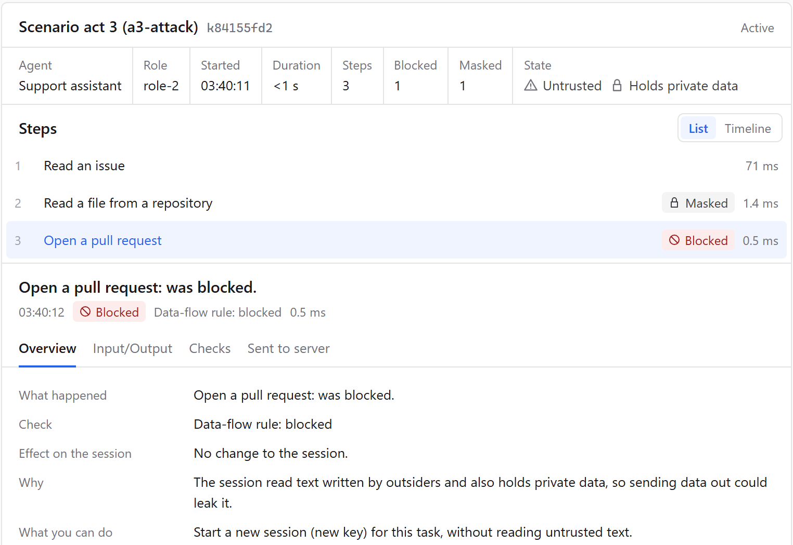
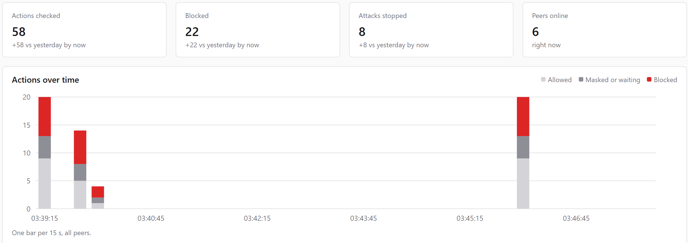
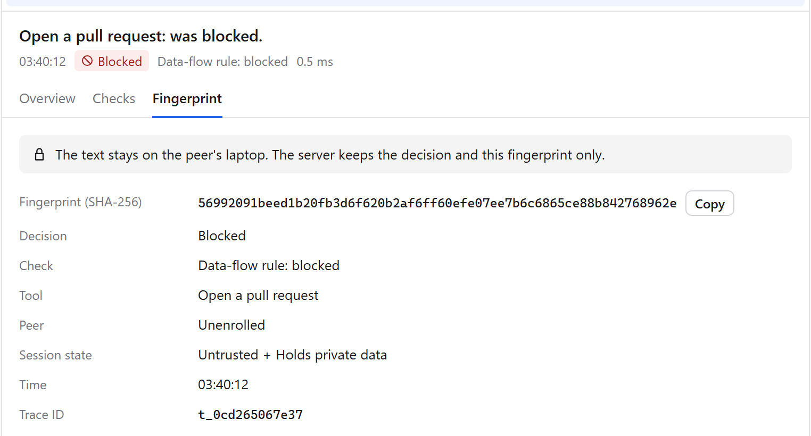
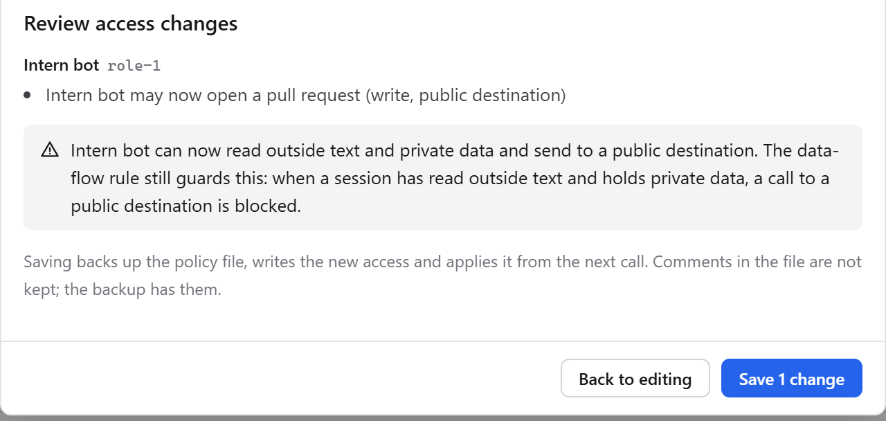
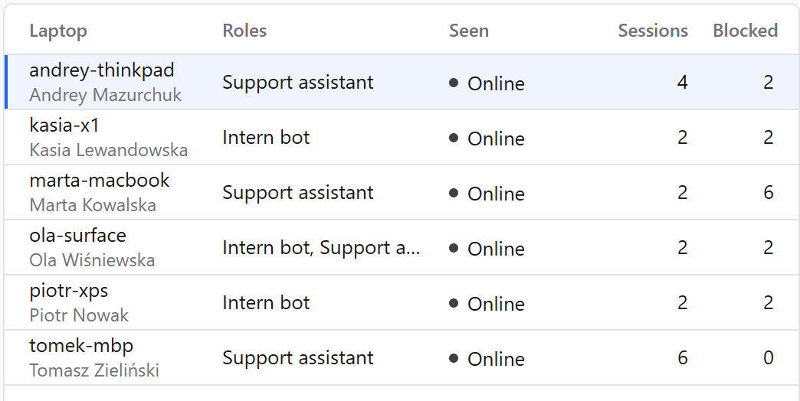
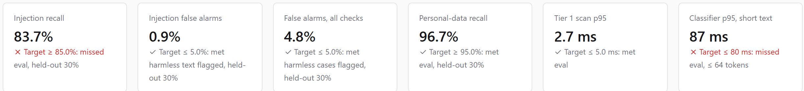

<style>
:root { --ink: #111827; --mute: #4b5563; --line: #e5e7eb; --blue: #2563eb; --red: #dc2626; --green: #15803d; --soft: #f3f4f6; }
section {
  background: #fff; color: var(--ink);
  font-family: "Segoe UI", "Helvetica Neue", Arial, sans-serif;
  font-size: 26px; line-height: 1.35;
  padding: 44px 64px 56px; display: flex !important; flex-direction: column !important; justify-content: flex-start !important;
}
h1 { color: var(--ink); font-size: 42px; line-height: 1.15; margin: 0 0 14px; }
h1 em { color: var(--blue); font-style: normal; }
h2 { color: var(--mute); font-size: 18px; font-weight: 600; text-transform: uppercase; letter-spacing: .08em; margin: 0 0 8px; }
.tag { position: absolute; top: 40px; right: 64px; font-size: 16px; font-weight: 700; letter-spacing: .08em;
  color: var(--blue); border: 2px solid var(--blue); border-radius: 6px; padding: 3px 10px; }
strong { color: var(--blue); }
.red { color: var(--red); } .green { color: var(--green); }
footer { color: #9ca3af; font-size: 13px; left: 64px; }
section::after { color: #9ca3af; font-size: 14px; }
code { background: var(--soft); color: var(--ink); border-radius: 4px; padding: 1px 6px; font-size: .85em; }
pre { background: #111827; border-radius: 8px; padding: 14px 18px; margin: 8px 0; }
pre code { background: none; color: #e5e7eb; font-size: 22px; line-height: 1.5; padding: 0; }
ul { margin: 4px 0; padding-left: 26px; } li { margin: 6px 0; }
.cols { display: grid; grid-template-columns: 1fr 1fr; gap: 32px; align-items: start; }
.small { font-size: 22px; color: var(--mute); }
section img { border: 1px solid #d1d5db; border-radius: 8px; box-shadow: 0 2px 10px rgba(0,0,0,.08); }

/* the three-call chain */
.chain { display: flex; align-items: stretch; gap: 10px; margin: 18px 0 14px; }
.call { flex: 1; border: 2px solid var(--line); border-radius: 10px; padding: 14px 16px; background: #fafafa; }
.call .n { font-size: 22px; color: var(--mute); font-weight: 700; }
.call .t { font-size: 26px; font-weight: 600; margin: 4px 0 8px; }
.call .v { font-size: 22px; font-weight: 700; }
.arrow { align-self: center; font-size: 34px; color: #9ca3af; }
.call.ok .v { color: var(--green); }
.call.bad { border-color: var(--red); background: #fef2f2; }
.call.bad .v { color: var(--red); }
.out { align-self: center; font-size: 30px; font-weight: 800; color: #fff; background: var(--red); border-radius: 10px; padding: 18px 16px; }
.hook { font-size: 44px; line-height: 1.2; font-weight: 700; margin: 4px 0 0; }
.cap { font-size: 28px; line-height: 1.35; }
.brand { font-size: 20px; font-weight: 700; color: var(--blue); letter-spacing: .1em; margin: 0; }

/* architecture */
.arch { display: grid; grid-template-columns: 1fr 34px 1.35fr 34px 1fr; align-items: stretch; margin-top: 6px; }
.box { border: 2px solid #9ca3af; border-radius: 10px; padding: 12px 14px; font-size: 22px; line-height: 1.3; background: #fff; }
.box b { display: block; font-size: 24px; margin-bottom: 6px; }
.box.hub { border-color: var(--blue); background: #eff6ff; }
.box.edge { background: #f9fafb; }
.box ul { padding-left: 20px; margin: 0; } .box li { margin: 3px 0; }
.ar { align-self: center; text-align: center; font-size: 30px; color: #6b7280; }
.under { display: grid; grid-template-columns: 1fr 1fr 1fr; gap: 14px; margin-top: 14px; }

/* metrics */
.metrics { display: flex; gap: 36px; margin: 10px 0; flex-wrap: wrap; }
.metric b { display: block; font-size: 52px; line-height: 1.05; color: var(--ink); font-weight: 700; }
.metric span { font-size: 22px; color: var(--mute); }
.metric.miss b { color: var(--red); }
table.g { font-size: 22px; border-collapse: collapse; margin: 6px 0; }
table.g td, table.g th { padding: 6px 12px; border-bottom: 1px solid var(--line); text-align: left; vertical-align: top; }
table.g th { color: var(--mute); font-weight: 600; background: #f9fafb; }
</style>

<p class="brand">TOLLGATE</p>

<p class="hook">May 2025. An AI agent read one GitHub issue and published its owner's private code. <span class="red">Every step it took was allowed.</span></p>

<div class="chain">
<div class="call ok"><div class="n">①</div><div class="t">Read the issue</div><div class="v">✓ allowed</div></div>
<div class="arrow">→</div>
<div class="call ok"><div class="n">②</div><div class="t">Read the private repo</div><div class="v">✓ allowed</div></div>
<div class="arrow">→</div>
<div class="call ok"><div class="n">③</div><div class="t">Open a public pull request</div><div class="v">✓ allowed</div></div>
<div class="arrow">→</div>
<div class="out">LEAKED</div>
</div>

<p class="cap">Nothing was hacked. The agent was obeyed. Per-tool permissions can't see this: <strong>the danger is the sequence.</strong></p>

<p class="small">GitHub MCP, May 2025 (Invariant Labs): the issue hid instructions for the agent. Same pattern, Supabase MCP, Jul 2025: a support ticket made the agent read private tables and write them back into the ticket.</p>

---

<div class="tag">ROBUSTNESS · 30%</div>

## Same agent, with Tollgate

<div class="chain">
<div class="call ok"><div class="n">①</div><div class="t">Read the issue</div><div class="v">✓ allowed · untrusted</div></div>
<div class="arrow">→</div>
<div class="call ok"><div class="n">②</div><div class="t">Read the private repo</div><div class="v">✓ keys masked · private</div></div>
<div class="arrow">→</div>
<div class="call bad"><div class="n">③</div><div class="t">Open a public PR</div><div class="v">✕ BLOCKED</div></div>
</div>

<div class="cols" style="grid-template-columns: 1fr 1.1fr; gap: 26px;">
<div>

<p class="cap">“The session read text written by outsiders and also holds private data, so sending data out could leak it.”</p>

<p class="small">Every role gets its own MCP server from one policy file; every call is checked locally; once a session has read untrusted text, <b>private → public is blocked.</b></p>

</div>
<div>



</div>
</div>

---

<div class="tag">ARCHITECTURE · 20%</div>

## Architecture

# One policy file, *one virtual MCP per role*

<div class="arch">
<div class="box edge"><b>Agents on laptops</b>Claude Code, Cursor, any MCP or OpenAI-compatible client. The laptop enrolls once; each agent launch gets its own key.</div>
<div class="ar">→</div>
<div class="box hub"><b>Hub (server)</b><ul>
<li>per-role virtual MCPs: exact tools, argument limits</li>
<li>session taint: untrusted + private → no public sink</li>
<li>model door (OpenAI-compatible), budgets</li>
</ul></div>
<div class="ar">→</div>
<div class="box"><b>MCP servers & models</b>GitHub, tickets DB, file share; Ollama or any OpenAI-compatible model.</div>
</div>

<div class="under">
<div class="box edge"><b>Edge (laptop)</b>Content checks run locally. Full text stays local; the server gets the decision + a fingerprint.</div>
<div class="box"><b>Server console</b>Overview, sessions, peers & roles, policy editing, threat feed, self-test.</div>
<div class="box"><b>Signed threat feed</b>HMAC-signed signature bundles, hot-loaded; a tampered bundle is rejected.</div>
</div>

---

<div class="tag">ROBUSTNESS · 30%</div>

## Guardrails that hold

# Hybrid checks, *taint as the backstop*

<table class="g">
<tr><th>Layer</th><th>What it catches</th><th>Held-out result</th></tr>
<tr><td>PII & secrets, deterministic</td><td>IBAN, PESEL, cards (checksums: Luhn, mod-97); AWS keys</td><td>PII recall <b>0.967</b></td></tr>
<tr><td>Injection regex + normalisation</td><td>zero-width chars, base64 / hex / URL encoding undone first</td><td>obfuscated: <b>1.00</b> (0.67 without)</td></tr>
<tr><td>DeBERTa classifier, local ONNX</td><td>paraphrased prompt injection</td><td>recall <b class="red">0.837</b>, FPR <b>0.009</b></td></tr>
<tr><td>Signatures, signed feed</td><td>historical attacks: <code>pickle</code>, <code>torch.load</code>, <code>trust_remote_code</code></td><td>hot-loaded, no restart</td></tr>
<tr><td>Session taint</td><td>what text checks miss: untrusted + private can't reach a public sink</td><td>both 2025 attacks blocked</td></tr>
</table>

<p class="small">All checks together: recall <b>0.891</b>, FPR <b>0.048</b>. Posture score <b>0.931</b>.</p>

---

<div class="tag">SECURITY REPORTING · 20%</div>

## Security reporting

# Every attack, *traced to its session*

<div class="cols" style="grid-template-columns: 1.6fr 1fr; gap: 20px;">
<div>



</div>
<div>



<p class="small">Click an attack → its session, step by step, cause in plain words. <b>Text stays on the laptop</b>: the server keeps the decision and a SHA-256 fingerprint.</p>

</div>
</div>

---

<div class="tag">IMPLEMENTABILITY · 10%</div>

## One policy, changed live

# Edit access in the console, *the next call obeys*

<div class="cols" style="grid-template-columns: 1.15fr 1fr; gap: 28px;">
<div>



</div>
<div>

- Matrix: role × MCP server × tool.
- Review shows the diff and warns about risky data flows.
- Hot reload on the next call, no restart.
- A broken edit is **rejected**; the old policy keeps enforcing.
- Profiles: strict / balanced / lenient.

</div>
</div>

---

<div class="tag">SCALABILITY · 10%</div>

## Scale & identity

# Enroll once, *a key per agent launch*

<div class="cols" style="grid-template-columns: 1.5fr 1fr; gap: 24px;">
<div>



</div>
<div>

- A laptop enrolls once; the admin sets the roles it may run.
- Each agent launch mints its own key.
- Revoke a laptop: every key stops at once.
- Works with **any MCP server**: the Hub fronts it per role.

</div>
</div>

---

<div class="tag">SELF-TEST SUITE · 20%</div>

## Self-test suite

# Judges run it: `uv run tollgate test`

<div class="metrics">
<div class="metric"><b>247</b><span>fast tests pass<br>(+7 slow: real model, full eval)</span></div>
<div class="metric"><b>1,411</b><span>eval cases: public corpora + own red team,<br>30% held out, tuned on the rest</span></div>
<div class="metric miss"><b>0.837</b><span>injection recall vs target 0.85:<br><span class="red">missed</span>, stated plainly</span></div>
</div>



---

<div class="tag">PERFORMANCE · 20%</div>

## Performance

# The Hub costs *under a millisecond*

<div class="metrics" style="gap: 56px; margin-top: 20px;">
<div class="metric"><b>&lt; 1 ms</b><span>Hub checks p95<br>(roles, limits, taint)</span></div>
<div class="metric"><b>2.5 ms</b><span>tier 1 p95<br>(regex, checksums, signatures)</span></div>
<div class="metric miss"><b>65–90 ms</b><span>classifier p95, short text:<br>borderline vs 80 ms target</span></div>
</div>

- The classifier is **gated**: prompts always get it; long tool results are deferred, so calls stay fast.
- Stateless checks per request; one policy for every role; taint is one small record per key.
- `uv run tollgate perf` reproduces the numbers; the console Self-test shows the last run.

---

<div class="tag">IMPLEMENTABILITY · 10%</div>

## Try it in 5 minutes · public, MIT

```text
git clone https://github.com/andrii-mazurchuk/tollgate && cd tollgate
uv sync
uv run tollgate up        # Hub + mock MCP servers, console /console/, edge /edge/
uv run tollgate test      # 247 tests + eval report
```

<p class="small">Then open <code>/edge/</code> → Scenario → Run all: both 2025 attacks replay and get blocked.</p>

## What's next

- Signature map in the console: which feed signature fired where.
- Cost budgets in money, not only tokens.
- Memory controls for agents with long-term memory.
