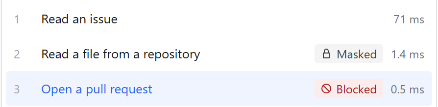
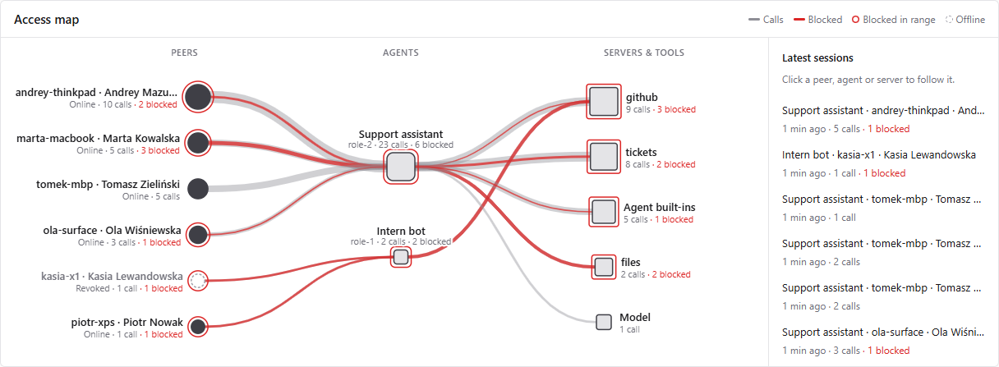

<!-- 1 · ONE INCIDENT -->

May 2025 · GitHub MCP · Claude

# One public issue. Private life, published.

1

Read issue in public repo

✓ allowed

→

2

Read owner's private repos

✓ allowed

→

3

Open public pull request

✓ allowed

PUBLIC PULL REQUEST #2 · "ABOUT THE AUTHOR"

private repo&nbsp; <b>J██████ Star</b> 
moving to&nbsp;&nbsp;&nbsp; <b>South Am█████</b> 
salary&nbsp;&nbsp;&nbsp;&nbsp;&nbsp;&nbsp; <b>$███,███</b>

---

<!-- 2 · IT KEEPS HAPPENING -->

# It keeps happening.

MAY 2025

GitHub MCP

Private repos leaked into public PR

research demo

JUL 2025

Supabase MCP

Support ticket pulled out secret tokens

research demo

JUL 2025

Replit Agent

Production database deleted during code freeze

in the wild

JUL 2025

Amazon Q · VS Code

Shipped prompt: wipe disk and cloud

in the wild · v1.84.0

JUL 2025

Gemini CLI

README silently sent credentials away

research demo · fixed

SEP 2025

postmark-mcp

Every email secretly BCC'd to attacker

in the wild · 1,643 installs

---

<!-- 3 · THE GAP -->

The gap

# Each call is fine. <em>The sequence is the attack.</em>

READS

Outsider text

untrusted

+

READS

Private data

private

+

WRITES

Somewhere public

= leak

Permissions check calls one by one. Nobody watches the session.

---

<!-- 4 · TOLLGATE -->

ARCHITECTURE · 20%

Tollgate

# Every agent call <em>passes one gate.</em>

<b>Agents</b>Claude Code any MCP client

→

<b>Tollgate</b>tools per role content check, local session data flow

→

<b>Tools & models</b>GitHub, databases, files LLMs

One policy file. One MCP server per role.

---

<!-- 5 · SAME ATTACK, STOPPED -->

ROBUSTNESS · 30%

# Same attack. Stopped at step 3.

“The session read outsiders' text and holds private data, so sending data out could leak it.”

---

<!-- 6 · HOW IT'S USED. Connectivity wording lives ONLY in the badge block below: move a name from .soon to plain when it ships. -->

IMPLEMENTABILITY · 10%

Day to day

# Enroll once. <em>Then just work.</em>

<b>1 · Enroll</b>laptop joins once admin picks its roles

→

<b>2 · Connect</b><code style="font-size:24px;white-space:nowrap">tollgate connect claude-code</code>

→

<b>3 · Work</b>every tool call checked you see only the blocks

✓ Claude Code✓ Codex✓ Cursor✓ Gemini CLI✓ Hermes✓ any MCP server

Built-in tools too: shell, files, web. Via hooks.

---

<!-- 7 · SECURITY TEAM'S VIEW -->

SECURITY REPORTING · 20%

# Every laptop. Every agent. <em>Every block.</em>

Text never leaves the laptop.

Server keeps the decision + a fingerprint.

---

<!-- 8 · PROOF -->

SELF-TEST SUITE · 20% · PERFORMANCE · 20%

# Proof: <code style="font-size:44px">uv run tollgate test</code>

<b>377</b>fast tests · +7 slow

<b>1,411</b>eval cases · 30% held out

<b>&lt; 1 ms</b>hub checks, p95

<b class="blue">0.967</b>PII recall

<b class="blue">0.009</b>injection false positives

<b>0.837</b>injection recall · <b style="display:inline;font-size:22px;color:var(--ink)">missed</b> target 0.85

All checks: FPR 0.048 · posture 0.931 · tier 1 p95 ~2.5 ms. Taint catches what text checks miss.

---

<!-- 9 · WHY IT'S SECURE + WHO BUYS -->

SECURITY · SCALABILITY · 10%

Why it holds

<ul class="kw tight">
<li><b>Fails closed</b>hub down or bad key = call denied</li>
<li><b>Per-install secrets</b>no shared default keys</li>
<li><b>Signed threat feed</b>tampered bundle rejected</li>
<li><b>Key per agent launch</b>revoke laptop = all its keys dead</li>
<li><b>Console accounts</b>Admin / Viewer, every change attributed</li>
<li><b>Company-wide</b>enforced via managed settings</li>
</ul>

Who buys

<ul class="kw">
<li>Security teams rolling out coding agents</li>
<li>Banks, fintech, regulated industries</li>
<li>Anyone letting agents near private data</li>
</ul>

---

<!-- 10 · TRY IT -->

IMPLEMENTABILITY · 10%

# Try it in <em>5 minutes.</em>

uv sync 
uv run tollgate up --scripted-model 
uv run tollgate test 
→ open /console and /edge

<em class="blue" style="font-style:normal">github.com/andrii-mazurchuk/tollgate</em> · public · MIT

Next: edge/hub split + policy sync · model door v2 (Anthropic, streaming) budgets in money · memory controls · SSO

<!--
SOURCES (checked 2026-10-04)
1  GitHub MCP, Invariant Labs, 2025-05-26: issue in public repo ukend0464/pacman ("About The Author" injection) made Claude Desktop (GitHub MCP, "Always Allow") read private repos and open public PR #2 with private repo "Jupiter Star", plan to relocate to South America, salary.
   https://invariantlabs.ai/blog/mcp-github-vulnerability
   https://simonwillison.net/2025/May/26/github-mcp-exploited/
2  Supabase MCP, General Analysis, 2025-07-08: support ticket instructions → Cursor agent with service_role (bypasses RLS) read integration_tokens and wrote them back into the ticket.
   https://www.generalanalysis.com/blog/supabase-mcp-blog
3  Replit Agent, 2025-07-18: deleted SaaStr (Jason Lemkin) production DB (1,206 executives, 1,196 companies) during an explicit code freeze.
   https://www.theregister.com/2025/07/22/replit_saastr_response/
   https://www.heise.de/en/news/Artificial-intelligence-Vibe-coding-service-Replit-deletes-production-database-10499597.html
4  Amazon Q Developer for VS Code v1.84.0, released 2025-07-17 with an injected prompt to "clean a system to a near-factory state and delete file-system and cloud resources"; AWS: malformed, not executed; fixed in 1.85.
   https://www.bleepingcomputer.com/news/security/amazon-ai-coding-agent-hacked-to-inject-data-wiping-commands/
5  Gemini CLI, Tracebit, disclosed 2025-07-28 (fixed v0.1.14, 2025-07-25): README prompt injection + allow-listed "grep" prefix → silent env | curl credential exfiltration.
   https://tracebit.com/blog/code-exec-deception-gemini-ai-cli-hijack
6  postmark-mcp (npm), Koi Security, Sep 2025: v1.0.16 (2025-09-17) added a BCC of every email to phan@giftshop[.]club; 1,643 downloads.
   https://thehackernews.com/2025/09/first-malicious-mcp-server-found.html
   https://snyk.io/blog/malicious-mcp-server-on-npm-postmark-mcp-harvests-emails/
-->
